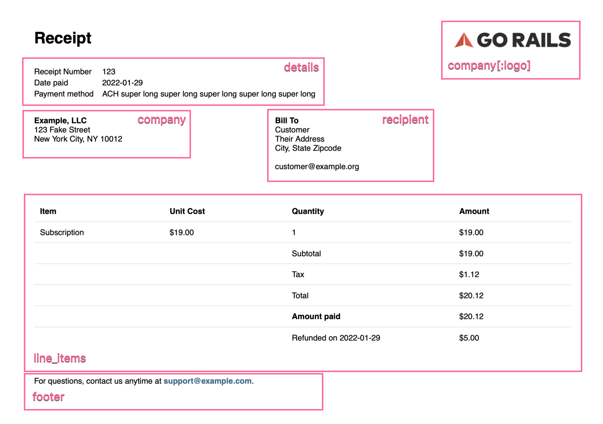

# Receipts Gem

Receipts, Invoices, and Statements for your Rails application that works with any payment provider. Receipts uses Prawn to generate the PDFs.

Check out the [example PDFs](https://github.com/excid3/receipts/blob/master/examples/).

## Installation

Add this line to your application's Gemfile:

```ruby
gem 'receipts'
```

And then execute:

    $ bundle

Or install it yourself as:

    $ gem install receipts

## Usage

To generate a Receipt, Invoice, or Statement, create an instance and provide content to render:

```ruby
r = Receipts::Receipt.new(
  # title: "Receipt",
  details: [
    ["Receipt Number", "123"],
    ["Date paid", Date.today],
    ["Payment method", "ACH super long super long super long super long super long"]
  ],
  company: {
    name: "Example, LLC",
    address: "123 Fake Street\nNew York City, NY 10012",
    email: "support@example.com",
    logo: File.expand_path("./examples/images/logo.png")
  },
  recipient: [
    "Customer",
    "Their Address",
    "City, State Zipcode",
    nil,
    "customer@example.org"
  ],
  line_items: [
    ["<b>Item</b>", "<b>Unit Cost</b>", "<b>Quantity</b>", "<b>Amount</b>"],
    ["Subscription", "$19.00", "1", "$19.00"],
    [nil, nil, "Subtotal", "$19.00"],
    [nil, nil, "Tax", "$1.12"],
    [nil, nil, "Total", "$20.12"],
    [nil, nil, "<b>Amount paid</b>", "$20.12"],
    [nil, nil, "Refunded on #{Date.today}", "$5.00"]
  ],
  footer: "Thanks for your business. Please contact us if you have any questions."
)

# Returns a string of the raw PDF
r.render

# Writes the PDF to disk
r.render_file "examples/receipt.pdf"
```

### Configuration

You can specify the default font for all PDFs by defining the following in an initializer:

```ruby
Receipts.default_font = {
  bold: Rails.root.join('app/assets/fonts/tradegothic/TradeGothic-Bold.ttf'),
  normal: Rails.root.join('app/assets/fonts/tradegothic/TradeGothic.ttf'),
}
```

### Options

You can pass the following options to generate a PDF:

* `recipient` - Array of customer details to include. Typically, this is name, address, email, VAT ID, etc.

* `company` - Hash of your company details

  * `name` - Company name

  * `address` - Company address

  * `email` - Company support email address

  * `phone` - Company phone number - _Optional_

  * `logo` - Logo to be displayed on the receipt - _Optional_
    This can be either a Path, File, StringIO, or URL. Here are a few examples:

    ```ruby
    logo: Rails.root.join("app/assets/images/logo.png")
    logo: File.expand_path("./logo.png")
    logo: File.open("app/assets/images/logo.png", "rb")
    logo: "https://www.ruby-lang.org/images/header-ruby-logo@2x.png" # Downloaded with OpenURI
    ```

* `details` - Array of details about the Receipt, Invoice, Statement. Typically, this is receipt numbers, issue date, due date, status, etc.

* `line_items` - Array of line items to be displayed in table format.

* `footer` - String for a message at the bottom of the PDF.

* `font` - Hash of paths to font files - _Optional_

  ```ruby
  font: {
    bold: Rails.root.join('app/assets/fonts/tradegothic/TradeGothic-Bold.ttf'),
    normal: Rails.root.join('app/assets/fonts/tradegothic/TradeGothic.ttf'),
  }
  ```

* `logo_height` - An integer value of how tall the logo should be. Defaults to `16`

Here's an example of where each option is displayed.



### Formatting

`details` and `line_items` allow inline formatting with Prawn. This allows you to use HTML tags to format text: `<b>` `<i>` `<u>` `<strikethrough>` `<sub>` `<sup>` `<font>` `<color>` `<link>`

See [the Prawn docs](https://prawnpdf.org/api-docs/2.3.0/Prawn/Text.html#text-instance_method) for more information.


##### Page Size

You can specify a different page size by passing in the `page_size` keyword argument:

```ruby
receipt = Receipts::Receipt.new page_size: "A4"
```

### Internationalization (I18n)

You can use `I18n.t` when rendering your receipts to internationalize them.

```ruby
line_items: [
  [I18n.t("receipts.date"),           created_at.to_s],
  [I18n.t("receipts.product"), "GoRails"],
  [I18n.t("receipts.transaction"), uuid]
]
```

### Custom PDF Content

You can change the entire PDF content by instantiating an Receipts object without any options.

```ruby
receipt = Receipts::Receipt.new # creates an empty PDF
```

Each Receipts object inherits from Prawn::Document. This allows you to choose what is rendered and include any custom Prawn content you like.

```ruby
receipt.text("hello world")
```

You can also use the Receipts helpers in your custom PDFs at the current cursor position.

```ruby
receipt.text("Custom header")
receipt.render_line_items([
  ["my line items"]
])
receipt.render_footer("This is a custom footer using the Receipts helper")
```

### Rendering PDFs

To render a PDF in memory, use `render`. This is recommended for serving PDFs in your Rails controllers.

```ruby
receipt.render
```

To render a PDF to disk, use `render_file`:

```ruby
receipt.render_file "receipt.pdf"
```

## Rendering PDFs in Rails controller actions

Here's an example Rails controller action you can use for serving PDFs. We'll first look up the database record for the `Charge` we want to render a receipt for.

The `Charge` model has a `receipt` method that returns a `Receipts::Receipt` instance with all the receipt data filled out.

Then we can `render` to generate the PDF in memory. This produces a String with the raw PDF data in it.

Using `send_data` from Rails, we can send the PDF contents and provide the browser with a recommended filename, content type and disposition.

```ruby
class ChargesController < ApplicationController
  before_action :authenticate_user!
  before_action :set_charge

  def show
    respond_to do |format|
      format.pdf { send_pdf }
    end
  end

  private

    def set_charge
      @charge = current_user.charges.find(params[:id])
    end

  	def send_pdf
      # Render the PDF in memory and send as the response
      send_data @charge.receipt.render,
        filename: "#{@charge.created_at.strftime("%Y-%m-%d")}-gorails-receipt.pdf",
        type: "application/pdf",
        disposition: :inline # or :attachment to download
    end
end
```

Then, just `link_to` to your charge with the format of `pdf`. For example:

```ruby
# config/routes.rb
resources :charges
```

```erb
<%= link_to "View Receipt", charge_path(@charge, format: :pdf) %>
```

## Invoices

Invoices follow the exact same set of steps as above. You'll simply want to modify the `details` to include other information for the Invoice such as the Issue Date, Due Date, etc.

```ruby
Receipts::Invoice.new(
  # title: "Invoice",
  details: [
    ["Invoice Number", "123"],
    ["Issue Date", Date.today.strftime("%B %d, %Y")],
    ["Due Date", Date.today.strftime("%B %d, %Y")],
    ["Status", "<b><color rgb='#5eba7d'>PAID</color></b>"]
  ],
  recipient: [
    "<b>Bill To</b>",
    "Customer",
    "Address",
    "City, State Zipcode",
    "customer@example.org"
  ],
  company: {
    name: "Example, LLC",
    address: "123 Fake Street\nNew York City, NY 10012",
    phone: "(555) 867-5309",
    email: "support@example.com",
    logo: File.expand_path("./examples/images/logo.png")
  },
  line_items: [
    ["<b>Item</b>", "<b>Unit Cost</b>", "<b>Quantity</b>", "<b>Amount</b>"],
    ["Subscription", "$19.00", "1", "$19.00"],
    [nil, nil, "Subtotal", "$19.00"],
    [nil, nil, "Tax Rate", "0%"],
    [nil, nil, "Amount Due", "$19.00"]
  ]
)
```

## Statements

Statements follow the exact same set of steps as above. You'll simply want to modify the `details` to include other information for the Invoice such as the Issue Date, Start and End Dates, etc.

```ruby
Receipts::Statement.new(
  # title: "Statement",
  details: [
    ["Statement Number", "123"],
    ["Issue Date", Date.today.strftime("%B %d, %Y")],
    ["Period", "#{(Date.today - 30).strftime("%B %d, %Y")} - #{Date.today.strftime("%B %d, %Y")}"]
  ],
  recipient: [
    "<b>Bill To</b>",
    "Customer",
    "Address",
    "City, State Zipcode",
    "customer@example.org"
  ],
  company: {
    name: "Example, LLC",
    address: "123 Fake Street\nNew York City, NY 10012",
    email: "support@example.com",
    phone: "(555) 867-5309",
    logo: File.expand_path("./examples/images/logo.png")
  },
  line_items: [
    ["<b>Item</b>", "<b>Unit Cost</b>", "<b>Quantity</b>", "<b>Amount</b>"],
    ["Subscription", "$19.00", "1", "$19.00"],
    [nil, nil, "Subtotal", "$19.00"],
    [nil, nil, "Tax Rate", "0%"],
    [nil, nil, "Total", "$19.00"]
  ]
)
```

## Contributing

1. Fork it ( https://github.com/excid3/receipts/fork )
2. Create your feature branch (`git checkout -b my-new-feature`)
3. Commit your changes (`git commit -am 'Add some feature'`)
4. Push to the branch (`git push origin my-new-feature`)
5. Create a new Pull Request

