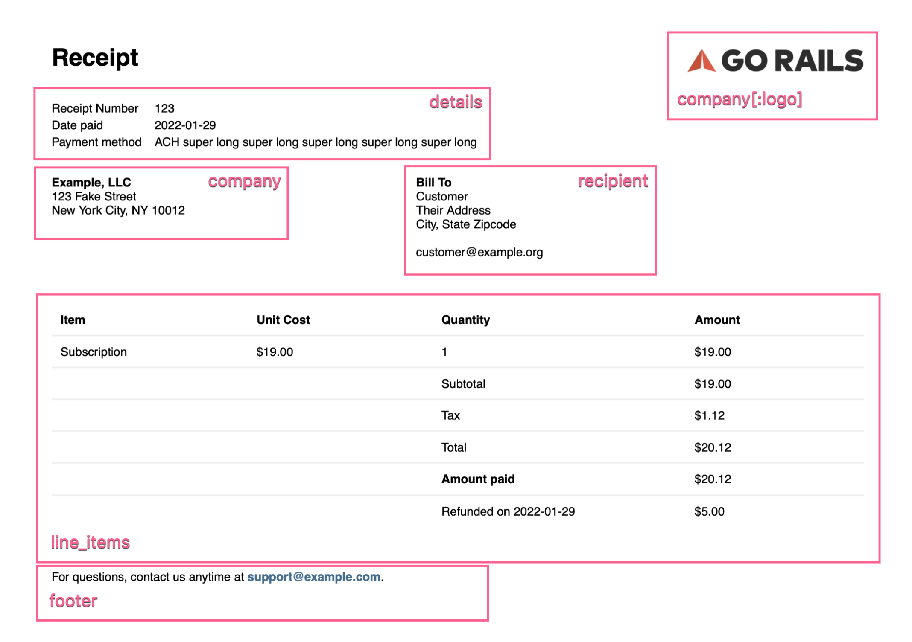

[](https://github.com/excid3/receipts/actions/workflows/ci.yml)

# Receipts Gem

Receipts, Invoices, and Statements for your Rails application that works with any payment provider. PDFs are generated in pure Ruby with no dependencies.

Check out the [example PDFs](https://github.com/excid3/receipts/blob/master/examples/).

## Installation

Add this line to your application's Gemfile:

```ruby
gem 'receipts'
```

And then execute:

```sh
$ bundle
```

Or install it yourself as:

```sh
$ gem install receipts
```

## Usage

To generate a Receipt, Invoice, or Statement, create an instance and provide content to render:

```ruby
r = Receipts::Receipt.new(
  # title: "Receipt",
  details: [
    ["Receipt Number", "123"],
    ["Date paid", Date.today],
    ["Payment method", "ACH super long super long super long super long super long"]
  ],
  company: {
    name: "Example, LLC",
    address: "123 Fake Street\nNew York City, NY 10012",
    email: "support@example.com",
    logo: File.expand_path("./examples/images/logo.png")
  },
  recipient: [
    "Customer",
    "Their Address",
    "City, State Zipcode",
    nil,
    "customer@example.org"
  ],
  line_items: [
    ["<b>Item</b>", "<b>Unit Cost</b>", "<b>Quantity</b>", "<b>Amount</b>"],
    ["Subscription", "$19.00", "1", "$19.00"],
    [nil, nil, "Subtotal", "$19.00"],
    [nil, nil, "Tax", "$1.12"],
    [nil, nil, "Total", "$20.12"],
    [nil, nil, "<b>Amount paid</b>", "$20.12"],
    [nil, nil, "Refunded on #{Date.today}", "$5.00"]
  ],
  footer: "Thanks for your business. Please contact us if you have any questions."
)

# Returns a string of the raw PDF
r.render

# Writes the PDF to disk
r.render_file "examples/receipt.pdf"
```

### Configuration

PDFs use the bundled [Noto Sans](https://fonts.google.com/noto/specimen/Noto+Sans) font by default, which supports Latin, Greek, and Cyrillic characters.

You can specify a different default font for all PDFs by defining the following in an initializer:

```ruby
Receipts.default_font = {
  bold: Rails.root.join('app/assets/fonts/tradegothic/TradeGothic-Bold.ttf'),
  normal: Rails.root.join('app/assets/fonts/tradegothic/TradeGothic.ttf'),
}
```

Fonts must be TrueType (`.ttf`) files. Only the characters used are embedded in each PDF. You may also provide `italic:` and `bold_italic:` fonts; otherwise italic text is simulated by slanting the normal font.

### Options

You can pass the following options to generate a PDF:

* `recipient` - Array of customer details to include. Typically, this is name, address, email, VAT ID, etc.

* `company` - Hash of your company details

  * `name` - Company name

  * `address` - Company address

  * `email` - Company support email address

  * `phone` - Company phone number - _Optional_

  * `logo` - Logo to be displayed on the receipt - _Optional_
    This can be either a Path, File, StringIO, or URL. Here are a few examples:

    ```ruby
    logo: Rails.root.join("app/assets/images/logo.png")
    logo: File.expand_path("./logo.png")
    logo: File.open("app/assets/images/logo.png", "rb")
    logo: "https://www.ruby-lang.org/images/header-ruby-logo@2x.png" # Downloaded with OpenURI
    ```

  * `display: []` - Customize the company details rendered. By default, renders `[:address, :phone, :email]` under the company name. Items in the array should be Symbols matching keys in the `company` hash to be displayed.

* `details` - Array of details about the Receipt, Invoice, Statement. Typically, this is receipt numbers, issue date, due date, status, etc.

* `line_items` - Array of line items to be displayed in table format.

* `footer` - String for a message at the bottom of the PDF.

* `font` - Hash of paths to font files - _Optional_

  ```ruby
  font: {
    bold: Rails.root.join('app/assets/fonts/tradegothic/TradeGothic-Bold.ttf'),
    normal: Rails.root.join('app/assets/fonts/tradegothic/TradeGothic.ttf'),
  }
  ```

* `logo_height` - An integer value of how tall the logo should be. Defaults to `16`

Here's an example of where each option is displayed.



#### Line Items Table - Column Widths

By default, columns are sized to fit their content and any leftover space is split evenly between columns. You may set the width of specific columns in points (1/72 inch) to override this.

This will size the second column to 400 and the fourth column to 50.

```ruby
column_widths: {1 => 400,3 => 50 }
```

This will set all column widths, considering your table has 4 columns.

```ruby
column_widths: [100, 200, 240]
```

Columns without a width are sized automatically.

### Formatting

`details`, `line_items`, `recipient` and `footer` allow inline formatting using HTML-like tags:

* `<b>` / `<strong>`, `<i>` / `<em>`, `<u>`, `<strikethrough>`, `<sub>`, `<sup>`, `<br>`
* `<font name="Primary" size="12" character_spacing="1">`
* `<color rgb="#5eba7d">` or `<color c="0" m="100" y="100" k="0">`
* `<link href="https://example.com">`

Use `&lt;`, `&gt;` and `&amp;` for literal `<`, `>` and `&` characters.

#### Page Size

You can specify a different page size by passing in the `page_size` keyword argument:

```ruby
receipt = Receipts::Receipt.new page_size: "A4"
```

### Internationalization (I18n)

You can use `I18n.t` when rendering your receipts to internationalize them.

```ruby
line_items: [
  [I18n.t("receipts.date"),           created_at.to_s],
  [I18n.t("receipts.product"), "GoRails"],
  [I18n.t("receipts.transaction"), uuid]
]
```

### Custom PDF Content

You can change the entire PDF content by instantiating an Receipts object without any options.

```ruby
receipt = Receipts::Receipt.new # creates an empty PDF
```

Each Receipts object inherits from `Receipts::PDF::Document`, which provides a small, Prawn-like API for adding your own content:

```ruby
receipt.text("hello world", size: 12, style: :bold, align: :center, color: "4b5563")
receipt.text("<b>Bold</b> and <i>italic</i>", inline_format: true)
receipt.move_down 20
receipt.image "logo.png", height: 24, position: :right
receipt.table([["Item", "Amount"], ["Product", "$10"]], width: receipt.bounds.width) do
  row(0).font_style = :bold
  column(1).align = :right
end
receipt.stroke_horizontal_rule
receipt.start_new_page
```

Images must be PNG (non-interlaced) or JPEG files.

You can also use the Receipts helpers in your custom PDFs at the current cursor position.

```ruby
receipt.text("Custom header")
receipt.render_line_items(line_items: [
  ["my line items"]
])
receipt.render_footer("This is a custom footer using the Receipts helper")
```

### Rendering PDFs

To render a PDF in memory, use `render`. This is recommended for serving PDFs in your Rails controllers.

```ruby
receipt.render
```

To render a PDF to disk, use `render_file`:

```ruby
receipt.render_file "receipt.pdf"
```

## Rendering PDFs in Rails controller actions

Here's an example Rails controller action you can use for serving PDFs. We'll first look up the database record for the `Charge` we want to render a receipt for.

The `Charge` model has a `receipt` method that returns a `Receipts::Receipt` instance with all the receipt data filled out.

Then we can `render` to generate the PDF in memory. This produces a String with the raw PDF data in it.

Using `send_data` from Rails, we can send the PDF contents and provide the browser with a recommended filename, content type and disposition.

```ruby
class ChargesController < ApplicationController
  before_action :authenticate_user!
  before_action :set_charge

  def show
    respond_to do |format|
      format.pdf { send_pdf }
    end
  end

  private

    def set_charge
      @charge = current_user.charges.find(params[:id])
    end

    def send_pdf
      # Render the PDF in memory and send as the response
      send_data @charge.receipt.render,
        filename: "#{@charge.created_at.strftime("%Y-%m-%d")}-gorails-receipt.pdf",
        type: "application/pdf",
        disposition: :inline # or :attachment to download
    end
end
```

Then, just `link_to` to your charge with the format of `pdf`. For example:

```ruby
# config/routes.rb
resources :charges
```

```erb
<%= link_to "View Receipt", charge_path(@charge, format: :pdf) %>
```

## Invoices

Invoices follow the exact same set of steps as above. You'll simply want to modify the `details` to include other information for the Invoice such as the Issue Date, Due Date, etc.

```ruby
Receipts::Invoice.new(
  # title: "Invoice",
  details: [
    ["Invoice Number", "123"],
    ["Issue Date", Date.today.strftime("%B %d, %Y")],
    ["Due Date", Date.today.strftime("%B %d, %Y")],
    ["Status", "<b><color rgb='#5eba7d'>PAID</color></b>"]
  ],
  recipient: [
    "<b>Bill To</b>",
    "Customer",
    "Address",
    "City, State Zipcode",
    "customer@example.org"
  ],
  company: {
    name: "Example, LLC",
    address: "123 Fake Street\nNew York City, NY 10012",
    phone: "(555) 867-5309",
    email: "support@example.com",
    logo: File.expand_path("./examples/images/logo.png")
  },
  line_items: [
    ["<b>Item</b>", "<b>Unit Cost</b>", "<b>Quantity</b>", "<b>Amount</b>"],
    ["Subscription", "$19.00", "1", "$19.00"],
    [nil, nil, "Subtotal", "$19.00"],
    [nil, nil, "Tax Rate", "0%"],
    [nil, nil, "Amount Due", "$19.00"]
  ]
)
```

## Statements

Statements follow the exact same set of steps as above. You'll simply want to modify the `details` to include other information for the Invoice such as the Issue Date, Start and End Dates, etc.

```ruby
Receipts::Statement.new(
  # title: "Statement",
  details: [
    ["Statement Number", "123"],
    ["Issue Date", Date.today.strftime("%B %d, %Y")],
    ["Period", "#{(Date.today - 30).strftime("%B %d, %Y")} - #{Date.today.strftime("%B %d, %Y")}"]
  ],
  recipient: [
    "<b>Bill To</b>",
    "Customer",
    "Address",
    "City, State Zipcode",
    "customer@example.org"
  ],
  company: {
    name: "Example, LLC",
    address: "123 Fake Street\nNew York City, NY 10012",
    email: "support@example.com",
    phone: "(555) 867-5309",
    logo: File.expand_path("./examples/images/logo.png")
  },
  line_items: [
    ["<b>Item</b>", "<b>Unit Cost</b>", "<b>Quantity</b>", "<b>Amount</b>"],
    ["Subscription", "$19.00", "1", "$19.00"],
    [nil, nil, "Subtotal", "$19.00"],
    [nil, nil, "Tax Rate", "0%"],
    [nil, nil, "Total", "$19.00"]
  ]
)
```

## Contributing

1. Fork it [https://github.com/excid3/receipts/fork](https://github.com/excid3/receipts/fork)
2. Create your feature branch (`git checkout -b my-new-feature`)
3. Commit your changes (`git commit -am 'Add some feature'`)
4. Push to the branch (`git push origin my-new-feature`)
5. Create a new Pull Request
